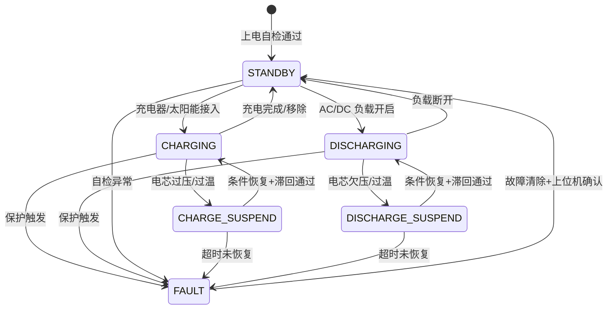

# EcoFlow EMS/IoT 业务规则文档 — Implementation Plan

> **For agentic workers:** REQUIRED SUB-SKILL: Use superpowers-subagent-driven-development (recommended) or superpowers-executing-plans to implement this plan task-by-task. Steps use checkbox (`- [ ]`) syntax for tracking.

**Goal:** Create three comprehensive, realistic EcoFlow business rule documents following the SSoT methodology with double-layer structure (business rules body + hardware appendix), covering BMS/Inverter, Home Energy Management, and IoT Cloud Communication.

**Architecture:** Three independent markdown documents under `business-rules/<domain>/<topic>.md`, each with YAML frontmatter, business process flows, state machines, exception tables, acceptance criteria, and hardware detail appendices. Documents share cross-references via YAML `related` field.

**Tech Stack:** Markdown (GFM) + YAML frontmatter, Mermaid/ASCII for diagrams, no code generation required.

---

## File Structure

```
business-rules/                          # CREATE root
├── portable-power/                      # CREATE
│   └── bms-inverter.md                  # CREATE (~650 lines)
├── home-energy/                         # CREATE
│   └── smart-panel.md                   # CREATE (~550 lines)
└── iot-cloud/                           # CREATE
    └── device-management.md             # CREATE (~500 lines)
```

---

## Task 1: Create Directory Structure

**Files:**
- Create: `business-rules/portable-power/`
- Create: `business-rules/home-energy/`
- Create: `business-rules/iot-cloud/`

- [ ] **Step 1: Create directories**

```bash
mkdir -p business-rules/portable-power business-rules/home-energy business-rules/iot-cloud
```

- [ ] **Step 2: Verify directory structure**

Run: `ls -la business-rules/`
Expected: Three subdirectories listed: `portable-power/`, `home-energy/`, `iot-cloud/`

- [ ] **Step 3: Commit**

```bash
git add business-rules/
git commit -m "feat: create business-rules directory structure for EcoFlow docs"
```

---

## Task 2: Write bms-inverter.md — BMS + Inverter Control

**Files:**
- Create: `business-rules/portable-power/bms-inverter.md`

**Context:** This is the largest document (~650 lines). Simulates a Delta Pro-level portable power station: 3.6kWh/3.6kW, 16S LFP cells (3.2V nominal, 51.2V system), BQ76952 AFE + STM32 MCU + ADS1115 ADC + INA228 current sensor.

- [ ] **Step 1: Write the complete bms-inverter.md**

Write file `business-rules/portable-power/bms-inverter.md` with the following content:

```markdown
---
id: RULE-BMS
title: BMS 电池管理 + 逆变器控制 — 便携储能系统 (Delta Pro)
status: approved
owner: pm-ecoflow-bms
version: v2.3
updated: 2026-07-01
platform: STM32F407 + BQ76952 AFE + ADS1115 ADC + INA228
chemistry: LiFePO4 (LFP), 16S1P, 3.2V/cell, 51.2V/70Ah nominal
related:
  - RULE-HOME-ENERGY-001   # Smart Panel 负载切换联动
  - RULE-IOT-CLOUD-001     # 遥测数据上报（RULE-BMS-001 采样数据）
---

# BMS 电池管理 + 逆变器控制 — 便携储能系统

## 概述

本文档定义 EcoFlow Delta Pro 级别便携储能设备的 BMS（Battery Management System）和逆变器控制全部业务规则。覆盖电芯采样、保护机制、均衡策略、SoC 估算、逆变器控制、MPPT 充电和故障码系统。

**系统参数速查：**
- 电芯类型：LFP 3.2V 标称，16S 串联，1P 并联
- 系统电压：51.2V 标称（40.0V ~ 58.4V 工作范围）
- 标称容量：70Ah / 3.58kWh
- 最大持续放电：70A（~3.6kW）
- 逆变器输出：230V AC / 50Hz 纯正弦波，额定 3600W，峰值 7200W（5s）
- 太阳能输入：11-150V DC，最大 1600W（双路 MPPT）

---

## 运行态状态机



---

## RULE-BMS-001: 电芯电压/温度采样

### 业务流程

```
上电 → 初始化 I2C1（400kHz Fast Mode [CONSTRAINT:timing]，SCL=PB6, SDA=PB7）
  → 配置 ADS1115: 地址 0x48, 增益 ±4.096V, 单次转换模式, 860 SPS [详见 §寄存器-ADS1115]
  → 配置 CD74HC4067 16:1 模拟多路复用器（GPIO PA0-PA3 通道选择）
  → 启用 TIM3 定时器，每 100ms 触发全电芯扫描 ISR：

ISR_VOLTAGE_SCAN:
  1. for cell=0 to 15:
       a. PA0-PA3 ← cell 通道号 [详见 §寄存器-MUX]
       b. delay_us(10)   // 通道建立时间 [CONSTRAINT:timing: ≥ 8μs]
       c. ADS1115 Config[0x01] ← 0xC3_83（AIN0-GND, ±4.096V, 单次）[详见 §寄存器-0x01]
       d. 等待转换完成（poll 0x01 bit15=1，或延迟 ≤ 1.2ms）
       e. 读 ADS1115 Conversion[0x00] 16-bit 有符号值
       f. voltage = adc_raw × (4.096 / 32768) → 存入 voltage_buffer[cell]
  2. 检查 voltage 合法性：2.0V < V_cell < 3.9V [MUST]，否则标记 ADC_FAULT
  3. 写入环形缓冲区 ring_buf_voltage[write_idx % 16] ← {timestamp, 16× voltage}

  每 500ms（TIM3 5 次扫描后）：
  → 独立读取 4 路 NTC（MCU ADC3 IN0-IN3，12-bit）
  → temp = NTC_lookup(adc_raw) → 存入 temp_buffer[0..3]
  → 写入环形缓冲区 ring_buf_temp[write_idx % 8] ← {timestamp, 4× temp}
```

### 异常处理

| 场景 | 检测方式 | 动作 | 恢复条件 | 级别 | AC |
|------|---------|------|---------|------|-----|
| ADC 通信超时 | I2C NACK 连续 3 次 | 标记 ADC_COMM_ERR, 触发 buzzer 告警 | I2C 复位 + 连续 3 次成功读取 | 1-严重 | AC-4 |
| 电压超出合法范围 | 2.0V < V_cell < 3.9V 检查失败 | 标记 ADC_READING_FAULT, 锁定充放电 | 连续 5 次读数正常 + 上位机清除 | 0-紧急 | AC-5 |
| NTC 开路 | ADC 读数 = 0xFFF（上拉） | 该通道温度 = -99°C 哨兵值, 标记 NTC_OPEN | NTC 读数恢复正常 | 2-一般 | — |
| 采样周期抖超 | 两次扫描间隔 > 120ms | 标记 TIMING_JITTER, 降级使用上次数据 | 连续 10 次间隔 < 105ms | 3-信息 | — |

### 验收标准

**AC-1:** ADC 全扫描完成中断触发 → 16 路电压值在 110ms 内 [CONSTRAINT:timing] 全部更新到 ring_buf_voltage，最大抖动 ≤ 5ms
**AC-2:** NTC 4 路温度在 510ms 内 [CONSTRAINT:timing] 更新到 ring_buf_temp，最大抖动 ≤ 20ms
**AC-3:** I2C 通信失败 3 次 → ADC_COMM_ERR 标志位置位，充放电禁止；I2C 复位后连续 3 次成功 → 自动清除
**AC-4:** 任一电芯电压超过 3.9V 或低于 2.0V → ADC_READING_FAULT 锁存，[MUST NOT] 自动恢复，[MUST] 上位机清除命令 [详见 §寄存器-0x1F]
**AC-5:** ring_buf_voltage 写满 16 组后，第 17 组覆盖最早数据（环形覆盖），读指针永远落后写指针 ≤ 16

---

## RULE-BMS-002: 过充/过放保护

### 保护阈值（LFP 16S 系统）

```
过充保护 (OVP):
  触发: 任一电芯 > 3.65V → 关断 CHARGE MOSFET [MUST]
  恢复: 所有电芯 < 3.40V → 可重新使能 CHARGE MOSFET
  滞回: 250mV（3.65 - 3.40 = 250mV，防止在阈值附近反复开关）

过放保护 (UVP):
  触发: 任一电芯 < 2.50V → 关断 DISCHARGE MOSFET [MUST]
  恢复: 所有电芯 > 2.80V → 可重新使能 DISCHARGE MOSFET
  滞回: 300mV

二级过充保护 (OVP2, 硬件):
  触发: 任一电芯 > 3.75V → 硬件熔断保险丝（不可逆）[CONSTRAINT:safety]
  由 BQ76952 OVP2 引脚直接驱动，绕过 MCU

二级过放保护 (UVP2, 硬件):
  触发: 任一电芯 < 2.20V → CHARGE MOSFET 也强制关断（防反充）[CONSTRAINT:safety]
  由 BQ76952 UVP2 硬件比较器实现
```

### 业务流程

```
保护主循环（每 100ms，在电压采样后执行）:

  OVP_CHECK:
    if MAX(cell_voltages[0..15]) > OVP_THRESHOLD (3.65V):
      → BQ76952 寄存器 0x05 CHG_FET ← 0 (关断) [详见 §寄存器-0x05]
      → 故障码寄存器 0x10 bit0 (CHG_OVP) ← 1 [详见 §寄存器-0x10]
      → 进入 CHARGE_SUSPEND 状态
    elif CURRENT_STATE == CHARGE_SUSPEND:
      if MAX(cell_voltages[0..15]) < OVP_RECOVERY (3.40V):
        → 等待上位机清除命令（0x1F ← 0x01）[详见 §寄存器-0x1F]
        → BQ76952 寄存器 0x05 CHG_FET ← 1 (导通)
        → 故障码寄存器 0x10 bit0 ← 0
        → 返回 STANDBY

  UVP_CHECK:
    if MIN(cell_voltages[0..15]) < UVP_THRESHOLD (2.50V):
      → BQ76952 寄存器 0x05 DSG_FET ← 0 (关断)
      → 故障码寄存器 0x10 bit1 (DSG_UVP) ← 1
      → 进入 DISCHARGE_SUSPEND 状态
    elif CURRENT_STATE == DISCHARGE_SUSPEND:
      if MIN(cell_voltages[0..15]) > UVP_RECOVERY (2.80V):
        → 等待上位机清除命令（0x1F ← 0x02）
        → BQ76952 寄存器 0x05 DSG_FET ← 1 (导通)
        → 故障码寄存器 0x10 bit1 ← 0
        → 返回 STANDBY
```

### MOSFET 关断时序

```
0μs:   检测到过压（ADC 读数 > 3.65V）
+5μs:  MCU 通过 I2C 写入 BQ76952 寄存器 0x05 [详见 §寄存器-0x05]
+8μs:  I2C 传输完成（400kHz, 2 字节地址 + 2 字节数据 = 40 bits）
+12μs: BQ76952 内部逻辑处理
+20μs: MOSFET gate driver 放电开始（Vgs 从 10V 下降）
+45μs: MOSFET 完全关断（Vgs < 2V, Rds(on) > 1MΩ）
```

### 异常处理

| 场景 | 检测方式 | 硬件动作 | 恢复条件 | 告警级别 | AC |
|------|---------|---------|---------|---------|-----|
| 任一电芯 > 3.65V | ADC 比较器 | CHG MOSFET 关断 ≤ 50μs [详见 §时序-OVP] | 所有电芯 < 3.40V + 上位机清除 | 1-严重 | AC-1 |
| 任一电芯 < 2.50V | ADC 比较器 | DSG MOSFET 关断 ≤ 50μs | 所有电芯 > 2.80V + 上位机清除 | 1-严重 | AC-2 |
| 任何电芯 > 3.75V | BQ76952 OVP2 硬件引脚 | 硬件熔断 fuse（不可逆） | 返厂维修 | 0-紧急 | AC-3 |
| MOSFET 关断失败 | 关断后 100ms 检测 CHG_DSG 引脚仍为高 | 尝试重发 3 次 I2C 命令, 失败则 MCU 直驱 GPIO 关断 | 下次保护触发时重试 | 0-紧急 | AC-4 |

### 验收标准

**AC-1:** 任一电芯电压 > 3.65V → CHG MOSFET 在 50μs 内关断 [CONSTRAINT:timing]，故障寄存器 0x10 bit0 置 1
**AC-2:** 任一电芯电压 < 2.50V → DSG MOSFET 在 50μs 内关断，故障寄存器 0x10 bit1 置 1
**AC-3:** OVP 触发后，仅所有电芯 < 3.40V + 上位机发送清除命令（0x1F ← 0x01）后方可恢复 CHG MOSFET 导通 [MUST]
**AC-4:** OVP2（3.75V 硬件触发）→ fuse 熔断，[MUST NOT] 可恢复
**AC-5:** MOSFET 关断命令发出后 100ms 检测到仍为高 → 重试 3 次，3 次失败则由 MCU 直驱 GPIO（PB12_CHG_CTRL / PB13_DSG_CTRL）关断 [MUST] [CONSTRAINT:safety]

---

## RULE-BMS-003: 过温保护（充放电分开）

### 温度阈值

```
充电温度保护:
  触发: NTC_max > 55°C → 关断充电，功率降至 0
  降额: NTC_max > 50°C → 充电功率降至 50% [MUST]
  恢复: NTC_max < 45°C → 功率恢复 100%
  滞回: 5°C

放电温度保护:
  触发: NTC_max > 65°C → 关断放电，功率降至 0
  降额: NTC_max > 60°C → 放电功率降至 50% [MUST]
  低温: NTC_min < -10°C → 禁止充电（仅放电，降额至 30%） [MUST]
  恢复: 放电 NTC_max < 55°C → 功率恢复, 充电 NTC_min > -5°C → 充电恢复

逆变器温度（热敏电阻 NTC_INV, MCU ADC3 IN4）:
  触发: T_inv > 95°C → 逆变器输出功率 → 0（硬件 shutdown，≤ 5ms）[CONSTRAINT:safety]
  降额: T_inv > 85°C → 逆变器线性降额至 50%
  恢复: T_inv < 75°C → 功率恢复，滞回 10°C
```

### 三级降功率策略

```
Level 0: 正常  (T < 50°C charge / T < 60°C discharge)
Level 1: 降额  (50°C ≤ T < 55°C charge, 60°C ≤ T < 65°C discharge) → 50% 功率
Level 2: 关断  (T ≥ 55°C charge, T ≥ 65°C discharge) → 0% 功率
```

### 时序约束

```
NTC 采样周期: 500ms [CONSTRAINT:timing]
降额响应延迟: ≤ 1s（采样 + 判断 + 执行）
关断响应延迟: ≤ 1s（thermal latency 除外）
温度恢复滞回检查: 需连续 3 次采样（1.5s）均在恢复阈值内 [SHOULD]
```

### 验收标准

**AC-1:** NTC_max > 55°C（充电）→ 1s 内充电功率降至 0，故障寄存器 0x10 bit3 置 1
**AC-2:** NTC_max > 65°C（放电）→ 1s 内放电功率降至 0，故障寄存器 0x10 bit4 置 1
**AC-3:** T_inv > 95°C → 逆变器在 5ms 内硬件关断 [CONSTRAINT:safety]，写入 NVRAM 标志防重启立即恢复
**AC-4:** 温度恢复后需连续 3 次采样均低于恢复阈值，方可允许恢复充放电功率
**AC-5:** NTC_min < -10°C → 充电 [MUST NOT] 允许，放电限制 30% 额定功率
**AC-6:** 降额发生时通过 I2C 通知 DC-DC 模块调整恒流目标值 [详见 §寄存器-INVERTER]

---

## RULE-BMS-004: 短路保护

### 检测机制

```
通道1: BQ76952 硬件 SCD (Short Circuit Detection)
  - 比较器阈值: 200A (RSENSE=0.5mΩ, V_threshold=100mV)
  - 检测延迟: ≤ 3μs（硬件比较器 + deglitch filter）
  - 动作: CHG/DSG FET 同时硬件关断 [CONSTRAINT:safety]

通道2: INA228 电流传感器 (软件 di/dt 检测)
  - 采样率: 3.5kHz (每 285μs 一次)
  - di/dt 阈值: > 500A/s（连续 3 次采样超过）
  - 动作: 软件关断 CHG/DSG FET

通道3: BQ76952 OCD (Over Current Detection)
  - 放电 OCD1: 100A, 延迟 320ms（软件脱扣）
  - 放电 OCD2: 150A, 延迟 30ms
  - 充电 OCC: 50A, 延迟 640ms
```

### 业务流程

```
MCU 启动 → 配置 INA228: 地址 0x40, 采样率 3.5kHz, 过流阈值 100A [详见 §寄存器-INA228]

ISR_CURRENT_SAMPLE (每 285μs):
  1. 读 INA228 Current[0x07]（24-bit 有符号）
  2. 计算 di/dt = (I_current - I_prev) / 0.000285
  3. if di/dt > 500 A/s:
       fast_trigger_count++
       if fast_trigger_count >= 3:
         → 紧急关断 CHG/DSG FET [详见 §寄存器-0x05]
         → 故障码 0x10 bit2 (SCD) ← 1
     else:
       fast_trigger_count = 0

BQ76952 SCD 硬件引脚（独立于 MCU）:
  一旦流过 RSENSE 电流 > 200A:
  → BQ76952 ALERT 引脚拉低 → MCU EXTI 中断
  → CHG/DSG FET 硬件自动关断（≤ 3μs）
  → 故障码 0x10 bit2 (SCD) ← 1, bit7 (FAULT_LATCH) ← 1 [MUST NOT] 自动恢复
```

### 异常处理

| 场景 | 检测 | 动作 | 恢复条件 | 级别 | AC |
|------|------|------|---------|------|-----|
| 短路 > 200A | BQ76952 SCD 硬件 | FET 全关断 ≤ 3μs [CONSTRAINT:safety] | 移除短路负载 + 上位机清除 0x1F←0x04 | 0-紧急 | AC-1 |
| di/dt > 500A/s ×3 | INA228 软件 | FET 全关断 ≤ 2ms | 移除负载 + 上位机清除 | 0-紧急 | AC-2 |
| 过流 > 100A 持续 320ms | OCD1 | DSG FET 关断 | 电流 < 50A 持续 1s | 1-严重 | AC-3 |

### 验收标准

**AC-1:** 短路电流 > 200A → BQ76952 SCD 在 3μs 内硬件关断 CHG/DSG FET [CONSTRAINT:safety]，0x10 bit2 和 bit7 同时置 1
**AC-2:** SCD 锁存后 [MUST NOT] 自动恢复，[MUST] 上位机发送清除命令 0x1F ← 0x04 + 负载已移除
**AC-3:** di/dt 连续 3 次 > 500A/s → 软件关断 FET ≤ 2ms
**AC-4:** 短路事件写入 NVRAM 事件日志（包含触发前 50ms 和后 10ms 的电流波形数据，共 210 个采样点）

---

## RULE-BMS-005: 被动电芯均衡

### 均衡策略

```
开启条件（全部满足 [MUST]）：
  1. 系统状态 = CHARGING 或 CHARGE_SUSPEND 恢复后
  2. 最高电芯电压 > 3.45V（进入 flat 区才均衡）
  3. 电压差值 = V_max - V_min > 30mV
  4. 所有电芯温度 < 45°C [CONSTRAINT:safety]

关闭条件（任一满足）：
  1. 电压差值 < 10mV（均衡完成）
  2. 最高电芯电压 > 3.55V（接近 OVP，停止均衡优先安全）
  3. 任一均衡电芯温度 > 50°C
  4. 单次均衡超过 2 小时（超时保护）[MUST]

均衡参数：
  均衡电流: 100mA（通过 33Ω 电阻旁路，BQ76952 内部 FET）
  均衡周期: 1s ON / 1s OFF（50% duty cycle，防止局部过热）
  最大同时均衡通道: 4 路（BQ76952 硬件限制）
```

### 业务流程

```
均衡主循环（每 10s 执行一次，在充电状态下）:

  1. 获取 sorted_cells[0..15]（按电压升序）
  2. 计算 V_max = sorted_cells[15], V_min = sorted_cells[0]
  3. 计算 V_diff = V_max - V_min

  4. if V_max > 3.45V AND V_diff > 30mV AND T_max < 45°C:
       target_cells = { 电压最高的前 min(4, count(V > V_min+20mV)) 个电芯 }
       for cell in target_cells:
         BQ76952 CBCTRL[cell] ← 1 (开启旁路) [详见 §寄存器-0x06]
       balance_timer = 3600 × 2（2 小时超时）
       balance_active = True

  5. 每秒中断切换: 奇数秒 ON → CBCTRL 保持，偶数秒 OFF → CBCTRL 全清零

  6. 退出条件检查:
       if V_diff < 10mV OR V_max > 3.55V OR T_max > 50°C OR balance_timer == 0:
         CBCTRL[0..15] ← 0x0000
         balance_active = False
```

### 验收标准

**AC-1:** V_max > 3.45V AND V_diff > 30mV AND T_max < 45°C → 均衡自动开启 [MUST]
**AC-2:** V_diff < 10mV OR V_max > 3.55V OR T_max > 50°C → 均衡立即停止，CBCTRL 寄存器在 100ms 内清零
**AC-3:** 均衡持续超 2 小时 → 自动关闭，标记 BALANCE_TIMEOUT 告警 [MUST]
**AC-4:** 同时均衡的通道数 [MUST NOT] 超过 4 路
**AC-5:** 均衡 duty cycle 为 50%（1s ON / 1s OFF），偏差 ≤ 100ms

---

## RULE-BMS-006: SoC 估算（库仑计 + OCV 校正）

### 估算模型

```
基础方法: 库仑计积分
  SOC(t) = SOC(t-1) + (I_avg × Δt) / Total_Capacity × 100%
  积分周期: Δt = 1s [CONSTRAINT:timing]
  电流采样率: INA228 3.5kHz → 1s 内取平均

OCV 校正条件（全部满足时重置 SoC）:
  1. 静置时间 > 30 分钟（电流 |I| < 0.5A）
  2. 电芯最大温差 < 5°C
  3. 距离上次 OCV 校正 > 6 小时 [SHOULD]

满充重置条件:
  1. CHARGING 状态
  2. 最高电芯电压 > 3.55V 持续 60 秒
  3. 充电电流 < 0.05C（< 3.5A）持续 60 秒
  → SOC = 100%, 库仑计数器清零
```

### OCV-SoC 查表（LFP 16S，25°C）

```
V_cell(V)  SoC(%)
3.60       100
3.45        95
3.40        90
3.35        80
3.33        70
3.30        60
3.28        50
3.25        40
3.20        30
3.10        20
3.00        15
2.80        10
2.50         5
2.00         0
```

### 验收标准

**AC-1:** 库仑计积分精度：±5% SoC（25°C，0.1C-1C 放电，排除静置 30min+ 后的 OCV 校正点）
**AC-2:** OCV 校正条件全部满足 → SoC 在 5s 内更新为查表值
**AC-3:** 满充条件满足 → SoC 重置为 100%，库仑计数器初始化为 70Ah
**AC-4:** 系统从 STANDBY 上电 → 首先读取 OCV 电压 + 查表获取初始 SoC，如不满足静置条件则使用 NVRAM 保存的上次 SoC
**AC-5:** SoC < 5% → 强制关断 DSG MOSFET [MUST]，无需 UVP 条件满足即提前保护

---

## RULE-BMS-007: 逆变器启停控制

### 预充电路时序

```
启动流程（绝对精确时序）:

T0:    上位机发送 INVERTER_ON 命令
T0+0:  MCU 检查前置条件: DSG MOSFET 已导通, SoC > 5%, 无故障锁存
T0+10ms:  闭合预充继电器 K_PRECHARGE（GPIO PC0）
          → 限流电阻 100Ω/50W 接入，电容预充电
T0+10ms+Δt:  等待 V_bus > 45V（MCU ADC1_IN0 监测）
          → 预充超时: 500ms (如 500ms 内 V_bus < 45V → 预充失败, 断开 K_PRECHARGE, 报故障)
T0+510ms: 闭合主继电器 K_MAIN（GPIO PC1）[MUST: K_PRECHARGE 必须先于 K_MAIN 闭合]
T0+520ms: 断开预充继电器 K_PRECHARGE（GPIO PC0 ← 0）
T0+530ms: 启动逆变器 PWM（TIM1 CH1-CH3, 互补输出, 死区 1μs）
T0+600ms: 软启动完成, V_out = 230V AC, f = 50Hz, 功率从 0 → P_target 线性上升(2s)

关断流程:
T0:    上位机发送 INVERTER_OFF 命令
T0+0:  逆变器 PWM 停止
T0+50ms:  断开主继电器 K_MAIN（GPIO PC1 ← 0）
T0+60ms:  所有继电器状态确认断开（回读 GPIO PC0-PC2 状态）
```

### 验收标准

**AC-1:** K_PRECHARGE 闭合后 [MUST] ≥ 10ms 才可闭合 K_MAIN [CONSTRAINT:timing]
**AC-2:** K_PRECHARGE 闭合后 [MUST] 在 K_MAIN 闭合后 ≥ 10ms 才可断开 [CONSTRAINT:timing]
**AC-3:** 预充超时 500ms 内 V_bus < 45V → K_PRECHARGE 断开，PRE_CHARGE_TIMEOUT 故障锁存
**AC-4:** 逆变器启动前 [MUST] 检查：DSG MOSFET 导通、SoC ≥ 5%、无故障锁存
**AC-5:** 关断时 [MUST] 先停 PWM 再断 K_MAIN（禁止带载拉弧 [CONSTRAINT:safety]）

---

## RULE-BMS-008: MPPT 太阳能输入

### 输入规格

```
PV 输入电压范围: 11V ~ 150V DC
MPPT 跟踪电压范围: 15V ~ 145V
最大输入功率: 800W × 2 路 = 1600W
最大输入电流: 15A × 2 路
启动电压: PV 电压 > 电池电压 + 5V
关机电压: PV 电压 < 电池电压 + 2V（滞回 3V）

MPPT 扫描周期: 每 10 分钟 [CONSTRAINT:timing]
  扫描范围: 15V ~ min(145V, Voc - 5V)
  扫描步进: 2V
  扫描停留: 每步 200ms
  锁定目标: P_max 对应的 V_mp
```

### 验收标准

**AC-1:** PV 电压 > V_bat + 5V → MPPT 在 5s 内启动
**AC-2:** MPPT 每 10 分钟执行全扫描 [CONSTRAINT:timing]，单次扫描 ≤ 30s
**AC-3:** 输入功率持续 > 800W 超过 30s → 触发降额至 800W（硬限流）
**AC-4:** PV 输入反接 → 硬件保护（反向二极管 + PTC），不损坏设备 [CONSTRAINT:safety]

---

## RULE-BMS-009: AC 充电策略

### 充电功率阶梯

```
Charge Phase 0 — 涓流预充:
  条件: 最低电芯 < 2.80V
  电流: 0.05C (3.5A), 功率 ≈ 180W
  退出: 最低电芯 > 2.80V

Charge Phase 1 — CC 恒流:
  条件: 2.80V ≤ V_max < 3.50V
  电流: 0.3C (21A), 功率 ≈ 1075W
  退出: V_max ≥ 3.50V

Charge Phase 2 — CV 恒压:
  条件: V_max ≥ 3.50V
  电压目标: 56.8V (3.55V/cell)
  电流: 逐渐衰减
  退出: I_charge < 0.05C (3.5A) 持续 60s → 满充

热管理联动 [详见 RULE-BMS-003]:
  NTC_max > 50°C: 充电电流降至 50%
  NTC_max > 55°C: 充电关断
```

### PFC 控制

```
PFC 工作范围:
  输入: 90V ~ 264V AC, 47Hz ~ 63Hz
  PF: > 0.99 @ 满载
  THD: < 5% @ 满载
  PFC 总线电压: 400V DC

启动：AC 输入检测稳定（连续 10 个半波周期频率在 47-63Hz）→ PFC 启动
关断：AC 输入丢失 > 20ms → PFC 停止，切换到电池供电 [CONSTRAINT:timing]
```

### 验收标准

**AC-1:** NTC_max > 50°C → 充电电流 ≤ 50% 设定值，1s 内响应
**AC-2:** AC 输入丢失 > 20ms → PFC 关断，系统切换为电池供电，切换时间 ≤ 10ms [CONSTRAINT:timing]
**AC-3:** Phase 0 → Phase 1 → Phase 2 切换根据电芯电压自动过渡，无电流尖峰（di/dt < 2A/ms）

---

## RULE-BMS-010: 故障码系统

### 故障码寄存器（0x10）

```
Bit  | 名称              | 描述                    | 锁存? | 清除方式
-----|-------------------|------------------------|-------|----------
0    | CHG_OVP           | 充电过压保护            | Yes   | 上位机 0x1F←0x01
1    | DSG_UVP           | 放点欠压保护            | Yes   | 上位机 0x1F←0x02
2    | SCD               | 短路保护                | Yes   | 上位机 0x1F←0x04
3    | CHG_OTP           | 充电过温保护            | No    | 温度恢复自动清
4    | DSG_OTP           | 放电过温保护            | No    | 温度恢复自动清
5    | CELL_IMBALANCE    | 电芯严重不均衡(V_diff>500mV) | No | V_diff恢复自动清
6    | COMM_ERR          | 通信异常（I2C/SPI 超时）| Yes   | 上位机 0x1F←0x08
7    | FAULT_LATCH       | 存在未清除的锁存故障     | —     | 所有锁存位清除后
8    | PRE_CHARGE_TIMEOUT| 预充超时                | Yes   | 上位机 0x1F←0x10
9    | INVERTER_FAULT    | 逆变器故障              | Yes   | 上位机 0x1F←0x20
10   | ADC_READING_FAULT | ADC读数异常             | Yes   | 上位机 0x1F←0x40
11   | NTC_OPEN          | NTC 开路               | No    | NTC恢复自动清
12   | BALANCE_TIMEOUT   | 均衡超时                | No    | 下次均衡启动清
13-15| RESERVED          | 保留                   | —     | —
```

### 告警分级

```
Level 0 — 紧急 (Emergency):
  - SCD (bit2), FAULT_LATCH (bit7), ADC_READING_FAULT (bit10)
  - 触发: 蜂鸣器持续响 5s, LED 红灯闪烁 2Hz, LCD 弹窗
  - 动作: 立即关断所有功率输出, [MUST NOT] 自动恢复

Level 1 — 严重 (Critical):
  - CHG_OVP (bit0), DSG_UVP (bit1), PRE_CHARGE_TIMEOUT (bit8), INVERTER_FAULT (bit9)
  - 触发: 蜂鸣器响 3 声, LED 红灯常亮
  - 动作: 关断对应通道, 需上位机清除或条件恢复

Level 2 — 一般 (Warning):
  - CHG_OTP (bit3), DSG_OTP (bit4), CELL_IMBALANCE (bit5), NTC_OPEN (bit11), BALANCE_TIMEOUT (bit12)
  - 触发: 蜂鸣器响 1 声, LED 黄灯
  - 动作: 降额运行, 条件恢复后自动清除

Level 3 — 信息 (Info):
  - COMM_ERR 首次 (bit6, 首次不锁存仅警告)
  - 触发: 无蜂鸣器, LED 无变化
  - 动作: 仅记录日志
```

### 故障清除协议

```
上位机 → MCU (I2C 写寄存器 0x1F):
  0x01: 清除 CHG_OVP 锁存
  0x02: 清除 DSG_UVP 锁存
  0x04: 清除 SCD 锁存
  0x08: 清除 COMM_ERR 锁存
  0x10: 清除 PRE_CHARGE_TIMEOUT 锁存
  0x20: 清除 INVERTER_FAULT 锁存
  0x40: 清除 ADC_READING_FAULT 锁存
  0xFF: 清除所有可清除故障（SCD 除外，需单独 0x04 确认）

MCU 回应:
  清除成功: 0x1F 回读 = 0x00（对应位），同时 0x10 对应 bit 清零
  清除失败: 如果故障条件仍然存在 → NACK，0x1F 保持原值
```

### 验收标准

**AC-1:** SCD (bit2) 触发后 [MUST NOT] 通过 0xFF 批量清除，[MUST] 单独发送 0x04
**AC-2:** 任何锁存故障清除后，对应 bit 和 FAULT_LATCH bit7 同时清零
**AC-3:** 非锁存故障条件恢复后 ≤ 2s 自动清除对应 bit
**AC-4:** 故障码寄存器 0x10 所有变更写入 NVRAM 事件日志（含时间戳）
**AC-5:** Level 0-1 故障触发时蜂鸣器 [MUST] 发声，Level 2-3 [SHOULD] 静默仅 LED/LCD

---

---

## 附录 A: 寄存器映射表

### A.1 BQ76952 AFE 寄存器 (I2C 地址 0x08)

| 地址 | 名称 | 位域 | R/W | 默认值 | 说明 |
|------|------|------|-----|--------|------|
| 0x00 | CONTROL_STATUS | [7:4] Resv, [3] SLEEP, [2] SHUTDOWN, [1] CC_ON, [0] ADC_ON | R/W | 0x03 | 芯片控制 |
| 0x05 | FET_CONTROL | [7:4] Resv, [3] CHG_FET, [2] DSG_FET, [1:0] Resv | R/W | 0x0C | MOSFET 控制（1=导通） → AC-1 |
| 0x06 | CBCTRL1_8 | [7:0] Cell 1-8 均衡使能（每 bit 一个电芯） | R/W | 0x00 | 电芯均衡控制 |
| 0x07 | CBCTRL9_16 | [7:0] Cell 9-16 均衡使能 | R/W | 0x00 | 电芯均衡控制 |
| 0x10 | FAULT_STATUS | [15:0] 故障码（见 RULE-BMS-010 位定义） | R | 0x0000 | 故障状态寄存器 → AC-3 |
| 0x14 | CELL1_VOLTAGE | [15:0] Cell1 电压，单位 1mV (0-65535mV) | R | 0x0000 | — |
| 0x15-0x23 | CELL2~16_VOLTAGE | 同上 | R | 0x0000 | 连续地址 0x14-0x23 |
| 0x2A | PACK_CURRENT | [15:0] 有符号，单位 1mA，RSENSE=0.5mΩ | R | 0x0000 | 充放电电流 → AC-2 |
| 0x1F | FAULT_CLEAR | [7:0] 清除命令（见 RULE-BMS-010 清除协议） | W | 0x00 | 上位机写即可清除对应故障 |

### A.2 ADS1115 ADC 寄存器 (I2C 地址 0x48)

| 地址 | 名称 | 位域 | R/W | 默认值 | 说明 |
|------|------|------|-----|--------|------|
| 0x00 | CONVERSION | [15:0] 16-bit 有符号转换结果 | R | 0x0000 | 本次转换结果 |
| 0x01 | CONFIG | [15] OS(1=start), [14:12] MUX, [11:9] PGA, [8] MODE, [7:5] DR, [4] COMP_MODE, [3] COMP_POL, [2] COMP_LAT, [1:0] COMP_QUE | R/W | 0x8583 | 读写配置 → AC-1 |
| 0x02 | LO_THRESH | [15:0] 比较器低阈值 | R/W | 0x8000 | — |
| 0x03 | HI_THRESH | [15:0] 比较器高阈值 | R/W | 0x7FFF | — |

### A.3 INA228 电流/功率监测 (I2C 地址 0x40)

| 地址 | 名称 | 位域 | R/W | 默认值 | 说明 |
|------|------|------|-----|--------|------|
| 0x00 | CONFIG | [15:0] ADC 配置：模式/转换时间/平均 | R/W | 0x0000 | 默认连续模式 |
| 0x01 | ADC_CONFIG | [15:12] MODE, [11:9] VBUS_CT, [8:6] VSHUNT_CT, [5:3] VTEMP_CT, [2:0] AVG | R/W | 0xFB68 | 3.5kHz shunt 采样 |
| 0x02 | SHUNT_CAL | [15:0] 分流校准值（RSHUNT=0.5mΩ, MAX_CURRENT=200A） | R/W | 0x0800 | 校准值=0.00512×0.5m×200A=5120 |
| 0x07 | CURRENT | [23:0] 24-bit 有符号电流值，单位取决于校准 | R | 0x000000 | Shunt 电压/RSHUNT → AC-2 |

### A.4 CD74HC4067 模拟多路复用器

| GPIO | 位 | 说明 |
|------|-----|------|
| PA0 | MUX_A0 | 通道选择 bit0 (LSB) |
| PA1 | MUX_A1 | 通道选择 bit1 |
| PA2 | MUX_A2 | 通道选择 bit2 |
| PA3 | MUX_A3 | 通道选择 bit3 (MSB) |
| — | — | Cell 0-15 分别映射到 MUX CH0-CH15 |
| — | — | 通道切换后稳定时间: ≥8μs [CONSTRAINT:timing] |

### A.5 MCU 控制 GPIO

| GPIO | 功能 | 有效电平 | 说明 |
|------|------|---------|------|
| PB12 | CHG_MOS_CTRL | 高有效 | 直驱 CHG MOSFET（BQ76952 故障后备） |
| PB13 | DSG_MOS_CTRL | 高有效 | 直驱 DSG MOSFET（BQ76952 故障后备） |
| PC0 | K_PRECHARGE | 高有效 | 预充继电器控制 |
| PC1 | K_MAIN | 高有效 | 主继电器控制 |
| PC2 | K_PV1 | 高有效 | PV1 输入继电器 |
| PC3 | K_PV2 | 高有效 | PV2 输入继电器 |

---

## 附录 B: 保护阈值总表

### B.1 电压保护阈值

| 参数 | 电芯级 | 系统级 (16S) | 恢复/滞回 | 方向 |
|------|--------|-------------|-----------|------|
| OVP (过充) | 3.65V | 58.4V | 3.40V / 250mV | CHG 关断 |
| OVP2 (二级过充) | 3.75V | 60.0V | 不可恢复 | Fuse 熔断 |
| UVP (过放) | 2.50V | 40.0V | 2.80V / 300mV | DSG 关断 |
| UVP2 (二级过放) | 2.20V | 35.2V | 不可自动恢复 | CHG+DSG 关断 |
| 均衡开启 | 3.45V | 55.2V | V_diff < 10mV | — |
| SoC 满充判定 | 3.55V | 56.8V | I < 0.05C | — |

### B.2 温度保护阈值

| 参数 | 阈值 | 恢复 | 滞回 | 动作 |
|------|------|------|------|------|
| 充电降额 | NTC_max > 50°C | < 45°C | 5°C | 充电功率 50% |
| 充电关断 | NTC_max > 55°C | < 45°C | 5°C | 充电关断 |
| 放电降额 | NTC_max > 60°C | < 55°C | 5°C | 放电功率 50% |
| 放电关断 | NTC_max > 65°C | < 55°C | 5°C | 放电关断 |
| 低温禁充 | NTC_min < -10°C | > -5°C | 5°C | 充电禁止+放电30% |
| 逆变器关断 | T_inv > 95°C | < 75°C | 10°C | HW shutdown 5ms |

### B.3 电流保护阈值

| 参数 | 阈值 | 延迟 | 恢复 |
|------|------|------|------|
| SCD 硬件短路 | 200A | ≤ 3μs | 上位机清除 |
| di/dt 软件短路 | 500A/s ×3 | ≤ 2ms | 上位机清除 |
| OCD1 过流 | 100A | 320ms | I < 50A 持续 1s |
| OCD2 过流 | 150A | 30ms | I < 50A 持续 1s |
| OCC 充电过流 | 50A | 640ms | I < 20A 持续 1s |
| MPPT 硬限流 | 15A/路 | 实时 | — |

---

## 附录 C: 时序约束清单

| ID | 约束 | 参数 | 标记 |
|----|------|------|------|
| T-001 | 电压全扫描周期 | 100ms ± 5ms | [CONSTRAINT:timing] |
| T-002 | NTC 采样周期 | 500ms ± 20ms | [CONSTRAINT:timing] |
| T-003 | MUX 通道切换稳定 | ≥ 8μs | [CONSTRAINT:timing] |
| T-004 | ADC 单次转换 | ≤ 1.2ms | [CONSTRAINT:timing] |
| T-005 | OVP MOSFET 关断 | ≤ 50μs | [CONSTRAINT:timing] |
| T-006 | SCD 硬件关断 | ≤ 3μs | [CONSTRAINT:safety] |
| T-007 | 预充等待 | ≥ 10ms (K_PRECHARGE→K_MAIN) | [CONSTRAINT:timing] |
| T-008 | AC 掉电检测切换 | ≤ 10ms | [CONSTRAINT:timing] |
| T-009 | SoC 积分周期 | 1s | [CONSTRAINT:timing] |
| T-010 | MPPT 扫描周期 | 10min | [CONSTRAINT:timing] |
| T-011 | 均衡 duty cycle | 1s ON / 1s OFF | [CONSTRAINT:timing] |
| T-012 | I2C 总线速率 | 400kHz | [CONSTRAINT:timing] |

---

## 附录 D: 通信帧格式

### D.1 I2C 寄存器写操作 (MCU → BQ76952)

```
| START | DEV_ADDR+W(0x10) | ACK | REG_ADDR(8bit) | ACK | DATA_L(8bit) | ACK | DATA_H(8bit) | ACK | STOP |
  1 bit      7+1 bits      1 bit    8 bits          1 bit   8 bits         1 bit   8 bits          1 bit  1 bit

  地址: 0x08 << 1 = 0x10 (7-bit addr 0x08 + W=0)
  数据: Little-endian 16-bit
  SCL 频率: 400kHz
  帧时间: ~60μs (含 START/STOP)
```

### D.2 SPI 故障帧 (MCU → 上位机, 突发模式)

```
| CMD(8bit) | FAULT_H(8bit) | FAULT_L(8bit) | CRC8(8bit) |
  0xA5        0x10[15:8]     0x10[7:0]       多项式 0x07

  SPI 模式: Mode 0 (CPOL=0, CPHA=0)
  速率: 2MHz
  CS: PA4 (低有效)
  帧周期: 100ms（主动推送，无需轮询）
```


