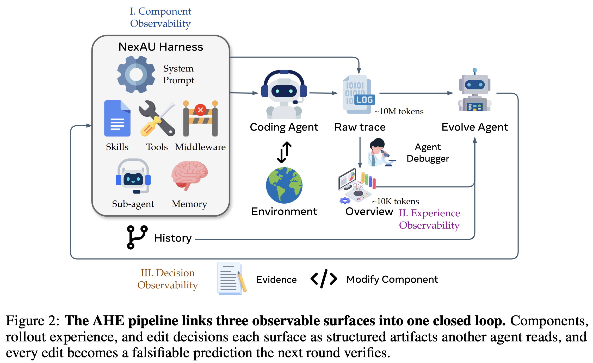

# Agentic Harness Engineering

## 目录

1. [什么是 Harness？](#什么是-harness)
2. [核心概念：Harness 的七个组件](#核心概念harness-的七个组件)
3. [一个典型的 Harness 目录树](#一个典型的-harness-目录树)
4. [为什么 Harness Engineering 是瓶颈](#为什么-harness-engineering-是瓶颈)
   - [手工工程化的极限](#手工工程化的极限)
   - [自动演化面临的三重障碍](#自动演化面临的三重障碍)
5. [AHE 原理：三支柱可观测性驱动的自动演化](#ahe-原理三支柱可观测性驱动的自动演化)
   - [支柱 1：组件可观测性（Component Observability）](#支柱-1组件可观测性component-observability)
   - [支柱 2：经验可观测性（Experience Observability）](#支柱-2经验可观测性experience-observability)
   - [支柱 3：决策可观测性（Decision Observability）](#支柱-3决策可观测性decision-observability)
6. [演化循环：从失败轨迹到可验证改进](#演化循环从失败轨迹到可验证改进)
   - [外层循环（Algorithm 1）](#外层循环algorithm-1)
   - [案例分析：db-wal-recovery 任务](#案例分析dbwalrecovery-任务)
   - [组件层级选择](#组件层级选择)
7. [关键实验发现](#关键实验发现)
   - [主实验：AHE 超越人工设计和自动化基线](#主实验ahe-超越人工设计和自动化基线)
   - [跨基准转移：Harness 具备通用性](#跨基准转移harness-具备通用性)
   - [跨模型转移：+5.1 到 +10.1 pp](#跨模型转移51-到-101-pp)
   - [组件消融：增益在哪？](#组件消融增益在哪)
   - [自归因的可靠性](#自归因的可靠性)
8. [在 Claude Code 中走向 Harness 自动演化](#在-claude-code-中走向-harness-自动演化)
   - [可观测性基础：Session JSONL](#可观测性基础session-jsonl)
   - [演化闭环](#演化闭环)
   - [举个例子](#举个例子)
   - [成熟度](#成熟度)
   - [实操建议](#实操建议)
9. [Harness 的注意事项与 Bad Smell](#harness-的注意事项与-bad-smell)
   - [本质：两类 Harness 内容](#本质两类-harness-内容)
   - [Bad Smell 清单](#bad-smell-清单)
   - [维护成本](#维护成本)
   - [Harness 的生命周期：从补丁到多余](#harness-的生命周期从补丁到多余)
   - [核心原则：实验驱动，而非经验预设](#核心原则实验驱动而非经验预设)

---

## 什么是 Harness？

在 AI Coding Agent（如 Claude Code、Codex CLI）中，**模型本身只是拼图的一块**。模型周围的工程组件同样决定了任务完成的质量。这些模型外部的、可编辑的组件集合，统称为 Agent 的 **Harness**（挽具/工装）。

> **直觉类比**：如果把 Coding Agent 比作一辆赛车，模型是引擎（提供核心动力），Harness 则是底盘、悬挂、轮胎和刹车——引擎再好，底盘松散也跑不出成绩。

Harness 包含系统提示词（system prompt）、工具（tools）、中间件（middleware）、技能库（skills）、子代理（sub-agents）、长期记忆（long-term memory）等。它决定了：

- 模型如何感知环境（能看到什么文件和上下文）
- 模型如何执行操作（能调哪些工具，工具的行为是什么）
- 模型如何从错误中恢复（中间件的拦截与重试逻辑）
- 模型的"工作风格"（提示词注入的行为准则）

研究表明，**即使在基础模型不变的情况下，Harness 设计的差异可以在长时间任务基准测试上产生显著的得分差异**。而且，最优的 Harness 是**模型特定的（model-specific）**：为一个基础模型调优的 Harness，换一个模型往往表现下降，需要重新适配。

[论文：2604.25850v3, Section 1]

---

## 核心概念：Harness 的七个组件

AHE 论文在 NexAU 框架上将 Harness 解耦为七个正交的组件类型，每个都以独立文件的形式存在：

| 组件 | 文件 | 作用 | 约束层级 |
|------|------|------|----------|
| **System Prompt**（系统提示词） | `systemprompt.md` | 行为规则、工作流指导，适用于所有任务 | 最弱（建议性） |
| **Tool Description**（工具描述） | `tool_descriptions/*.tool.yaml` | 解释工具用法、参数含义、注意事项 | 弱（文档性） |
| **Tool Implementation**（工具实现） | `tools/` | 控制工具的实际执行行为 | 强（执行级） |
| **Middleware**（中间件） | `middleware/` | 挂入 agent 循环管线，拦截/转换输入输出 | 强（管线级） |
| **Skill**（技能） | `skills/` | 按需加载的可复用工作流模式 | 中（注入式） |
| **Sub-Agent**（子代理） | `sub_agents/` | 隔离上下文的委派执行单元 | 强（隔离级） |
| **Long-Term Memory**（长期记忆） | `LongTermMEMORY.md` | 跨会话持久化的经验教训 | 中（参考性） |

**关键设计原则**：组件之间是**松耦合**的——添加一个 middleware 不需要修改 system prompt，添加一个 skill 不影响任何 tool。这种解耦使得每个失败模式可以清晰地映射到单一组件，演化 agent 可以精确地在正确的层级上做修改。

[论文：Section 3.1, Appendix B.1-B.2]

---

## 一个典型的 Harness 目录树

在理解七个组件之后，下面用一个虚拟项目的完整目录树直观展示：**从项目源码到 .claude 配置，哪些内容在充当 Agent 的 Harness**。

```
my-project/
│
├── CLAUDE.md                          # ① System Prompt — 全局行为规则与架构约束
├── README.md                          #    项目总览
├── SPEC.md                            #    可执行规格（AC 验收标准，Agent 自检依据）
├── PRD.md                             #    产品需求定义
│
├── api/
│   └── openapi.yaml                   #    接口契约（强类型 Schema，Agent 不猜参数）
│
├── src/
│   ├── modules/
│   │   ├── auth/                      #    DDD 限界上下文：认证
│   │   │   ├── README.md              #       模块级 Purpose / Interfaces / Constraints
│   │   │   ├── EXPERIENCE.md          #       本模块的经验陷阱（从 Git History 提炼）
│   │   │   ├── auth_service.py        #       Type Hints = 代码级文档
│   │   │   └── auth_schema.py         #       Pydantic → Agent 的"强类型提示"
│   │   ├── profile/                   #    限界上下文：用户画像
│   │   │   ├── README.md
│   │   │   ├── EXPERIENCE.md
│   │   │   └── ...
│   │   └── notification/              #    限界上下文：通知
│   │       ├── README.md
│   │       └── ...
│   └── shared/
│       └── types.py
│
├── docs/
│   └── adr/                           #    架构决策记录
│       ├── 001-sqlite-not-pg.md       #       为什么选 SQLite — 防止 Agent 走回头路
│       └── 002-jwt-session.md         #       认证方案选型
│
├── design-system/                     #    设计约束（被 Skills 和 System Prompt 引用）
│   ├── tokens.css
│   └── constraints.md
│
├── .importlinter                       # Architecture as Code — 模块依赖规则
├── pyproject.toml                      # Lint / Type Check（mypy, ruff）
├── .github/workflows/ci.yml           # CI — 提交即验证
│
├── .claude/
│   ├── settings.json                  # ② Tool 权限 — allowlist / deny list
│   ├── settings.local.json
│   │
│   ├── hooks/                         # ③ Middleware — 管线拦截（PreToolUse / PostToolUse）
│   │   ├── validate-commit.sh         #    提交前自动跑 lint + test
│   │   ├── secret-scanner.js          #    阻止密钥泄露
│   │   └── dangerous-cmd-guard.js     #    拦截危险命令
│   │
│   ├── skills/                        # ④ Skills — 按需注入的工作流
│   │   ├── code-review/
│   │   ├── debug/
│   │   ├── test-run/
│   │   └── deploy/
│   │
│   │── mcp/                            # ⑦ MCP 扩展工具
│   │   └── slack-server.py
│   │
│   ├── agents/                        # ⑤ Sub-Agents — 隔离执行的委派单元
│   │   ├── code-reviewer.md
│   │   ├── debugger.md
│   │   └── planner.md
│   │
│   ├── experience/                    # ⑥ 跨模块经验的索引（具体经验文件在代码目录中）
│   │   └── INDEX.md                   #    "新增路由 → src/modules/EXPERIENCE.md"
│   │
│   └── memory/                        # ⑥ 跨会话记忆
│       ├── user.md
│       ├── project.md
│       └── feedback.md
│
└── scripts/                           # 工具支撑脚本
    ├── reset_db.sh
    └── seed_data.py
```

这棵树的每一部分都可以归入五个层级：

| 层 | 涵盖内容 | 约束强度 | 存在形式 |
|---|---------|---------|---------|
| **架构层** | 模块目录结构、OpenAPI、Type Hints、DDD 限界上下文 | ★★☆☆☆ | 源码目录 + 类型系统 + 接口契约 |
| **文档层** | CLAUDE.md、模块 README、ADR、SPEC、PRD、design-system | ★★☆☆☆ | Markdown，渐进披露，按需下钻 |
| **经验层** | 模块 EXPERIENCE.md、.claude/experience/INDEX.md、memory/ | ★★☆☆☆ | 结构化经验文件，随代码 colocate |
| **约束层** | import-linter、pyproject.toml、CI、Hooks | ★★★★☆ | 可执行规则 + 管线拦截 |
| **执行层** | Skills、Sub-Agents、settings.json 权限、MCP、scripts | ★★★★☆ | 注入 Prompt + 隔离执行 + allowlist |

---

## 为什么 Harness Engineering 是瓶颈

### 手工工程化的极限

当前实践中，Harness 的调优几乎全靠**人工**：
1. 开发者检查运行轨迹（trajectory）
2. 识别重复出现的失败模式
3. 手工修改 prompt、工具或中间件
4. 重新运行验证

但随着基础模型快速迭代（每个月都有新模型发布），手工循环根本跟不上节奏，形成"模型能力提升 → Harness 跟不上 → 新模型的实际效果被 Harness 拖累"的困境。

### 自动演化面临的三重障碍

如果用另一个 Agent 来自动优化 Harness，会遇到三个结构性难题：

| 难题 | 说明 | AHE 的解法 |
|------|------|-----------|
| **异质动作空间** | 可编辑的组件类型不同（prompt 是文本，tool 是代码，middleware 是 Python 类），动作空间的表示不统一 | **组件可观测性**：每个组件都变成文件，git diff 就是动作记录 |
| **轨迹信息淹没** | 一次运行产生数百万 token 的原始轨迹，其中只有极少数是有用信号 | **经验可观测性**：分层蒸馏，从原始轨迹 → 单任务分析 → 基准概览 |
| **效果难以归因** | 修改了 prompt 后得分涨了，到底是因为这条修改还是因为随机波动？ | **决策可观测性**：每次修改附带自声明的预测，下一轮验证 |

这三个障碍的本质，正如论文的核心洞察所言：

> **"瓶颈在于可观测性（observability），而非 agent 能力。"**
>
> 一旦演化 agent 获得了结构化上下文和清晰的动作空间，它就能可靠地收敛到更好的 Harness 设计。

---

## AHE 原理：三支柱可观测性驱动的自动演化



AHE（Agentic Harness Engineering）的核心设计理念是：**演化循环的每个阶段都必须是可观测的**。这通过三个可观测性支柱实现。

### 支柱 1：组件可观测性（Component Observability）

**做法**：将 Harness 的七个组件类型全部暴露为文件系统中的显式文件，每个逻辑修改对应一次 git commit。

**效果**：
- 失败模式 → 单一组件类的映射路径清晰
- 每次得分变动归因到具体文件，而非散落在数百行非结构化的 prompt 文本中
- Git 历史提供了文件级 diff 和回滚粒度

**种子 Harness（H₀）的设计哲学**：刻意极简——只有一个 shell 执行工具，没有 middleware，没有 skills，没有 sub-agents。这是为了**避免种子本身污染归因**：如果种子已经很适配目标基准，就无法分辨增益来自演化循环还是来自种子本身。

### 支柱 2：经验可观测性（Experience Observability）

**做法**：用 Agent Debugger 将百万 token 的原始轨迹蒸馏为分层、可下钻的证据语料。

蒸馏管线：

```
原始轨迹 (~10M tokens)
    ↓ 清洗：去掉 base64、去重工具输出
清洗后轨迹 (~1M tokens)
    ↓ Agent Debugger：用 agent 分析轨迹，寻找根因
单任务分析报告 (per-task analysis)
    ↓ 聚合
基准级概览 (benchmark-level overview)
```

**Agent Debugger 的工作方式**：把每条轨迹消息放进独立文件，形成可导航的文件系统环境。Debugger agent 通过通用的 shell 和脚本工具访问轨迹，分析失败根因或成功模式，生成结构化的分析报告。

**渐进式信息披露（Progressive Disclosure）**：概览 → 详细分析 → 原始轨迹，按需下钻，节省 token 消耗。

### 支柱 3：决策可观测性（Decision Observability）

**做法**：Evolve Agent 的每次修改都附带一个 **change manifest**（变更清单），包含：

```json
{
  "id": "chg-1",
  "description": "修改了什么，为什么",
  "failure_pattern": "要解决的失败模式",
  "predicted_fixes": ["应该修复的任务A", "任务B"],
  "risk_tasks": ["可能被破坏的任务C"],
  "constraint_level": "middleware|tool_impl|tool_desc|skill|prompt"
}
```

**下一轮验证**：将预测的修复/回归集合与实际观测到的任务级 delta 做交集，生成每条修改的裁决：
- ✅ 预测的修复实际出现了 → 保留
- ❌ 预测的修复没出现 / 预测的回归出现了 → **回滚**

**关键约束**：
- **Controllability（可控性）**：Evolve Agent 只能写 `workspace/` 目录；runs/、LLM 配置、验证器都是只读的
- **Evidence-driven（证据驱动）**：每条修改必须追溯到具体的失败证据，禁止基于直觉的"最佳实践"式修改

> **这为什么重要？** 在没有决策可观测性的情况下，自动演化容易退化为 trial-and-error —— agent 不断随机尝试修改，偶尔运气好得分涨了就保留。AHE 让每次修改都变成**可证伪的合约**（falsifiable contract），无效修改会被自动发现和回滚。

[论文：Section 3, Algorithm 1, Appendix B.2]

---

## 演化循环：从失败轨迹到可验证改进

### 外层循环（Algorithm 1）

```
迭代 t = 1, 2, ..., N:
  Phase 1: 用当前 Harness H_{t-1} 跑 k 次 rollout（k≥2，per task）
  Phase 2: 清洗轨迹（去 base64、去重）
  Phase 3: 归因上一轮的 change manifest，回滚无效修改
  Phase 4: Agent Debugger 蒸馏轨迹 → 分层证据语料
  Phase 5: Evolve Agent 读证据 → 编辑 workspace → 输出新 manifest
  Phase 6: Git commit，记录迭代快照
  保留 best-so-far
```

### 案例分析：db-wal-recovery 任务

**任务**：从损坏的 SQLite WAL 文件中重建数据库表。

**演化前的失败轨迹**（种子 Harness，得分 0）：
1. 从过时的 shell 缓冲区读取 WAL 字节
2. 只看到 5 行数据，猜测缺失的 6 行遵循 `value = id × 100` 的模式
3. 提交了凭空编造的数据
4. 自我检查只数了行数（"json length == 11"），而非对照真实验证器

**演化后的修改 (chg-1)**：在 system prompt 中追加 8 条通用规则，包括：
- "Contract first"：测试和验证器脚本是真相的来源，不是 shell 历史
- "Generalize, do not overfit"：不要从可见样本推断
- "Mirror the evaluator"：用验证器断言做最终检查

**演化后的成功轨迹**（同一随机种子，得分 1.0）：
1. 重新逐字阅读任务规格，"WAL changes"被理解为对现有行的**修改**
2. 从原始磁盘恢复 WAL 文件
3. 正确解析所有 11 行，包括被修改的行（value=150 而非 100）
4. 最终验收步骤完全镜像了验证器的断言

**关键点**：修改的 prompt 中没有提"SQLite"、"WAL"、"db-wal-recovery"这些具体词——AHE 提取的是**通用工程经验**，而非任务特定的 hack。

### 组件层级选择

分析失败模式后，选择正确的组件层级来修复：

| 失败模式 | 错误层级 | 正确层级 | 原因 |
|----------|---------|---------|------|
| agent 在验收后删除交付物 | prompt 规则 | **tool 实现** | prompt 建议挡不住执行；需要在 shell 工具中做硬拦截 |
| agent 忽略 risk 警告 | middleware（after_tool） | **middleware（before_model）** | 警告跟在 tool output 后面，模型在下一轮看不到；需要注入到 reasoning context |
| agent 使用简陋的自检替代验证器 | prompt | **middleware** | 需要跨步骤状态追踪来检测"你用行数检查替代了字段断言" |

**约束层级**（从强到弱）：

> Tool Implementation > Middleware > Skill > Tool Description > System Prompt

[论文：Section 3, Appendix C]

---

## 关键实验发现

### 主实验：AHE 超越人工设计和自动化基线

在 Terminal-Bench 2（89 个任务）上，10 轮 AHE 迭代（约 32 小时）：

| 方法 | 总得分 | Easy | Medium | Hard |
|------|--------|------|--------|------|
| Codex CLI（人工设计） | 71.9% | 75.0% | 80.0% | 56.7% |
| NexAU 0（种子） | 69.7% | 87.5% | 78.2% | 51.7% |
| ACE（自动演化，仅 prompt） | 68.9% | 91.7% | 78.2% | 48.9% |
| TF-GRPO（自动演化） | 72.3% | 100.0% | 79.4% | 55.6% |
| **AHE** | **77.0%** | **100.0%** | **88.2%** | 53.3% |

> ACE 和 TF-GRPO 只能编辑 prompt / skill，无法触及 tools、middleware、memory——而这些正是增益所在的组件层。

### 跨基准转移：Harness 具备通用性

在 SWE-bench-verified（500 个真实 GitHub issue）上，**无需重新演化**：

| 指标 | ACE | TF-GRPO | NexAU 0 | **AHE** |
|------|-----|---------|---------|---------|
| 成功率 | 74.6% | 74.2% | 75.2% | **75.6%** |
| Token 消耗 | 679k | 582k | 526k | **461k**（-12%） |

AHE 不仅在成功率上领先，而且**平均节省 12% token**——因为它在 tools/middleware/memory 中编码行为，避免每次调用都重新推导。

### 跨模型转移：+5.1 到 +10.1 pp

AHE Harness 在不同的基础模型上（不做任何调整）都能带来正向提升：

| 基础模型 | NexAU 0 种子 | 使用 AHE Harness | 增益 |
|----------|-------------|-----------------|------|
| deepseek-v4-flash | 51.7% | 61.8% | **+10.1 pp** |
| qwen-3.6-plus | 56.2% | 62.5% | **+6.3 pp** |
| gemini-3.1-flash-lite | 36.5% | 41.6% | **+5.1 pp** |
| GPT-5.4 high | 69.7% | 77.0% | **+7.3 pp** |

**规律**：能力离饱和越远的基础模型，从 AHE Harness 中获益越大——因为弱模型更需要 Harness 中编码的协调模式。

### 组件消融：增益在哪？

逐组件拆解 AHE 的贡献：

| 变体 | 总得分 | 相对种子 |
|------|--------|---------|
| NexAU 0 种子 | 69.7% | — |
| + memory only | 75.3% | **+5.6 pp** |
| + tool only | 73.0% | **+3.3 pp** |
| + middleware only | 71.9% | **+2.2 pp** |
| + system_prompt only | 67.4% | **-2.3 pp** ❌ |
| AHE 全量 | 77.0% | +7.3 pp |

**核心发现**：
1. **增益在 tools、middleware、long-term memory**，不在 system prompt
2. System prompt 单独使用反而退步（-2.3 pp）：prose 层的策略不具备可转移性
3. 组件之间**非加性交互**：三个正组件单独增益之和为 +11.1 pp，但全量只有 +7.3 pp（部分效果重叠，甚至互相干扰）

> **结论**：**事实性的 Harness 结构（工具做什么、中间件怎么拦截）可以跨任务和跨模型转移，而散文式的策略指导（prompt 写什么）不能。**

### 自归因的可靠性

Evolve Agent 的自声明预测准确度：

| 维度 | 精确率 | 召回率 | 随机基线 |
|------|--------|--------|---------|
| 修复预测（fix） | **33.7%** | **51.4%** | 6.5% / 10.6% |
| 回归预测（regression） | 11.8% | 11.1% | 5.6% / 5.4% |

- 修复预测约 5 倍于随机基线：agent 确实能基于证据定位问题，而非瞎猜
- **回归预测近乎瞎蒙**：agent 能解释为什么修改应该有效，但无法预测哪些任务会被意外破坏

这指出未来方向：**回归预见能力（regression foresight）是自动演化循环最明确的前沿**。

[论文：Section 4, Table 1-3, Figure 3-4]

---

## 在 Claude Code 中走向 Harness 自动演化

AHE 的核心主张是 Harness 可以成为一个可观测、可自动演化的适应层。Claude Code 已经具备跑通这个闭环的基础设施，本章给出大致思路和关键细节。

### 可观测性基础：Session JSONL

Claude Code 每次会话都会在 `~/.claude/projects/<项目名>/` 下保存结构化日志 `<session-id>.jsonl`，每行一条 JSON，记录该轮的 message、tool call 及 tool result。这是自动化演化的数据起点。

从 JSONL 中可直接提取的信号：

- `tool_result` 中 `is_error: true` → 工具调用失败
- 同一 tool call 连续出现 ≥3 次 → agent 陷入无效重试循环
- `Stop` / `PreToolUse` hook 的触发记录 → 拦截事件
- session 有 task 描述但无完成标记 → 任务提前终止

这些信号几行 `jq` 或 Python 就能批量扫描，不需要人工翻日志。

### 演化闭环

```
近 N 天 JSONL → 脚本提取失败信号 → 聚合为失败模式（频次、类型）
    → LLM 批量分析根因 + 推荐修复层级
    → 生成 harness 变更（修改 settings.json / CLAUDE.md / skill）
    → 人工确认后应用
    → 继续采集新 session 日志，对比修改前后同一失败模式的频次变化
```

关键细节：

- **失败提取**：Python 脚本遍历 JSONL 目录，按 `is_error`、连续重复 tool call、hook 类型打标签，输出按频次排序的失败模式列表。
- **根因分析**：把聚合后的失败模式 + 典型 JSONL 片段喂给 LLM，让它判断每个失败适合在 prompt / skill / hook / tool 哪一层修复。
- **效果验证**：对比变更前后各 7 天的 session 日志，目标失败模式频次下降 → 保留；不变或上升 → 回滚换层级。

### 举个例子

agent 频繁在 `npm install` 失败后仍继续 `npm run build`，最终 build 也失败，浪费 token。

- 脚本发现该模式在过去 10 个 session 中出现 7 次。
- LLM 分析判断：最适合用 PreToolUse hook 拦截 — 在 agent 执行 `npm run build` 前检查上一步 `npm install` 的 exit code。
- 生成 hook 配置，确认后应用。一周后对比：频次从 7/10 降到 1/10。

### 成熟度

| 能力 | 做法 |
|------|------|
| JSONL 解析 + 失败统计 | Python 脚本遍历，`jq` 预处理也行 |
| 变更前后频次对比 | 按时间段拉两个 batch 做 diff |
| LLM 批量根因分析 | 聚合失败片段喂给 LLM，输出修复建议 |
| 自动生成 harness 变更 | 脚本生成 diff，人工确认 |
| 全自动闭环 | 需要回归预见能力（前沿方向），避免修 A 坏 B |

### 实操建议

- **先攒数据**。确保 session 日志积累到几十个再分析，数据太少偏差大。
- **先跑只读闭环**。第一步只做分析脚本，输出"Top 3 高频失败模式 + 推荐层级"。跑通了再考虑自动应用。
- **每次变更记录预测**。commit message 里写一句"预计减少 X 类失败"，验证时对号入座。
- **一个失败模式只在一个层级修**。多层冗余不加增益只加 token。同一层级连修两次没效果，果断换层级。

---

## Harness 的注意事项与 Bad Smell

AHE 论文证明了 Harness 可以自动演化并带来增益，但不代表 Harness 越多越好。Harness 本身有代价。

### 本质：两类 Harness 内容

Harness 是在模型能力边界上的补丁，但并非所有补丁同质：

| 类型 | 特征 | 示例 | 可被模型进化替代？ |
|------|------|------|-------------------|
| **A. 架构/设计约束** | 代码分析不出来的决策理由、权衡、约定 | ADR（为什么选 SQLite 而非 PG）、模块边界约定、安全策略 | ❌ 不可。这些是"选择"，不是"推导"——代码只展示选了 SQLite，无法表达为什么不选 PG |
| **B. 代码重复型提示** | 复述代码已有的信息 | "调用 `get_user()` 传入 `user_id: int`"（函数签名已有类型标注）、"先读 A 再改 B"（import 关系已说明依赖） | ✅ 可以。随着模型搜索和理解能力提升，这类提示纯属冗余 |

A 类是 Harness 的价值所在——承载"为什么这么做"的设计知识。B 类是膨胀的主要来源——也是 Evolve Agent 最容易大量生成的内容（失败轨迹常表现为"agent 没找到某接口"）。

> Harness 的好坏不在于多全面，而在于多精准——每一行都是模型当前确实做不到的事。

### Bad Smell 清单

| Bad Smell | 症状 | 后果 |
|-----------|------|------|
| **过时假设（Stale Assumption）** | prompt 里写"模型不擅长 X，请先 Y"，但当前模型已能直接做 X | 增 token，可能误导模型绕远路 |
| **重叠规则（Rule Overlap）** | 同一约束同时出现在 system prompt、skill、hook 三层 | 难定位哪条真正生效，修改易漏 |
| **防御性膨胀（Defensive Bloat）** | 为防范罕见失败，规则列表越来越长 | prompt 臃肿，模型抓不住重点 |
| **幽灵组件（Ghost Component）** | skill / sub-agent 创建后从未被调用 | 混淆"哪些东西真正在跑" |
| **硬编码工作流（Hardcoded Workflow）** | "先读 A 再读 B 再改 C"写死，代码结构已变 | agent 按过时流程走，做无用功 |
| **万能 Prompt 补丁（Prompt-as-Duct-Tape）** | 遇到问题就往 prompt 加一句，而非在 tool/middleware 层修复 | prompt 越来越长，约束力没变强（论文证明 prompt-only 是退步的） |
| **重复陷阱（Trap Duplication）** | 多个 EXPERIENCE.md 记录相同陷阱 | 经验散落，更新不一致 |
| **经验噪音（Experience Noise）** | 经验文件记录"曾有效但现在无效"的建议 | 误导 agent 采用过时方案 |
| **Harness 优先思维（Harness-First Thinking）** | 遇失败第一反应是"加个 skill/hook"，而非先分析根因 | 外包模型能力问题给 Harness，抑制从代码结构层面解决 |
| **推理替代脚本（Reasoning-over-Scripting）** | prompt 里让 agent 推理校验"检查 X、Y、Z"，而 10 行脚本即可确定性完成 | 浪费 token 做编译器的事；推理有概率性，脚本是确定性的 |

### 维护成本

Harness 带来两个维度的成本：

**理解成本**：没有 Harness 时，agent 的奇怪行为要么是模型问题要么是 prompt 问题，排查路径短。有了 Harness 后，行为可能来自 system prompt → CLAUDE.md → skill 注入 → hook 拦截 → sub-agent 独立 prompt——排查路径长了数倍，像继承链过深的 OOP 系统。

**维护负担**——在 AHE 自动生成 Harness 的背景下尤为严重：

1. **生成容易，清理难**。模型几秒生成 hook，判断半年后是否仍有效却需要人类理解当时的上下文。生成速度远超审阅速度。
2. **缺乏所有权**。"谁加的这条规则？为什么加？还能删吗？" 三个问题常无人能答。
3. **测试缺失**。代码有测试保护，改了会红。Harness 变更没有等价保护——删一条规则，可能数天后才发现行为退化。
4. **熵增不可逆**。不清楚哪条规则在保护哪个边缘 case，删错代价高，保留成默认。

> Harness 需要和代码一样的维护纪律——定期审查、清理过期组件。但多数团队对 Harness 的维护投入远低于代码。

### Harness 的生命周期：从补丁到多余

Harness 的价值随模型能力提升而衰减，一句话概括：

> **模型能力边界不断上移。今天在 Harness 覆盖区里的内容，明天被模型内化后，就从"有用的补丁"变成"多余的噪音"。**

更深层看，模型在长上下文中的退化并非"信息过载"，而是**主动的认知节省决策**——它选择"少想一些"（Reasoning Shift 现象）。修复路径正从外部脚手架转向模型内部认知校准，外部重型组件的前提正在消失。

实践含义：

1. **每次换模型版本，跑裸奔基线**。只保留仍产生统计显著提升的组件。
2. **把 Harness 组件设计成"可退役"的**。标注创建时间和触发条件，定期审查"当前模型下还成立吗？"
3. **认识到 Harness 的演化方向是越来越精准，而非越来越厚**。过去需要整套 skill 的任务，未来可能一条 tool description 就够。

### 核心原则：实验驱动，而非经验预设

> **Harness 的存在依据是"实验证明有效"，而不是"工程师觉得应该有"。**

| 不该做的 | 应该做的 |
|----------|---------|
| 因"模型常犯这类错"就预设性加 hook | 先跑 20 次任务统计实际频次，再看是否需加 |
| 复制别人项目的 skill 套件 | 从最小种子 Harness 开始，只加被验证需要的 |
| 凭直觉判断"这条规则应该有用" | 每次加规则带预测和验证，对比加前后的任务完成率 |
| 一次性加一整套规则 | 每次只加一条，单独验证效果，无效回滚 |
| 因 Harness 有效就一直保留 | 定期用新模型跑裸奔基线，判断边际价值 |

经验预设不可靠的三个原因：

1. **经验来自旧模型**。对 v1 有效的规则对 v2 可能有害——最优 Harness 是模型特定的。
2. **经验来自其他项目**。任务分布、代码结构不同，Harness 不具备跨项目可移植性。
3. **确认偏误**。失败了加规则，下次成功了——但成功可能是随机波动（论文中回归预测准确率仅 11.8%）。

> 把每个 Harness 组件当作**可证伪的实验假设**，而非最佳实践清单。加之前问"证据在哪"，加之后问"效果怎么验证"，效果消退后问"能不能删"。

---
